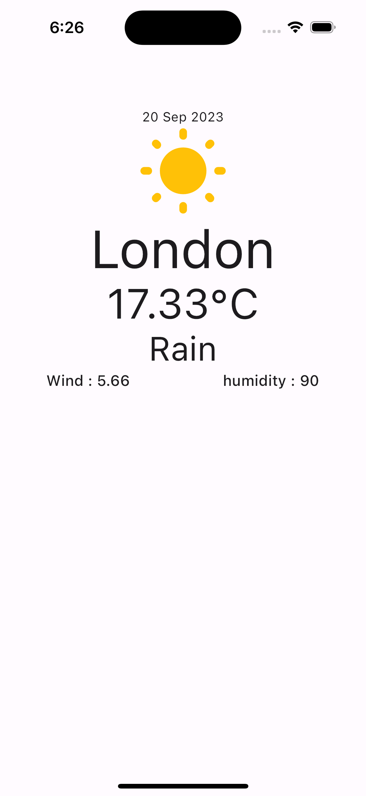

# Flutter Weather API 

API =>
 [Weather API LINK](https://openweathermap.org/api) 

## Screenshots

  

    
    
  

- [Linkedin](https://www.linkedin.com/in/vural-kayra-cetintas/)
- [Github](https://github.com/vuralkayracetintas)
- [Instagram](https://www.instagram.com/vuralkayrac/)

## Packages
- [kartal](https://pub.dev/packages/kartal):
- [flutter_bloc](https://pub.dev/packages/flutter_bloc):
- [equatable](https://pub.dev/packages/equatable):
- [http](https://pub.dev/packages/http):
- [intl](https://pub.dev/packages/intl):
- [cupertino_icons](https://pub.dev/packages/cupertino_icons): 

